# CAN Bus Network Simulator with Arduino

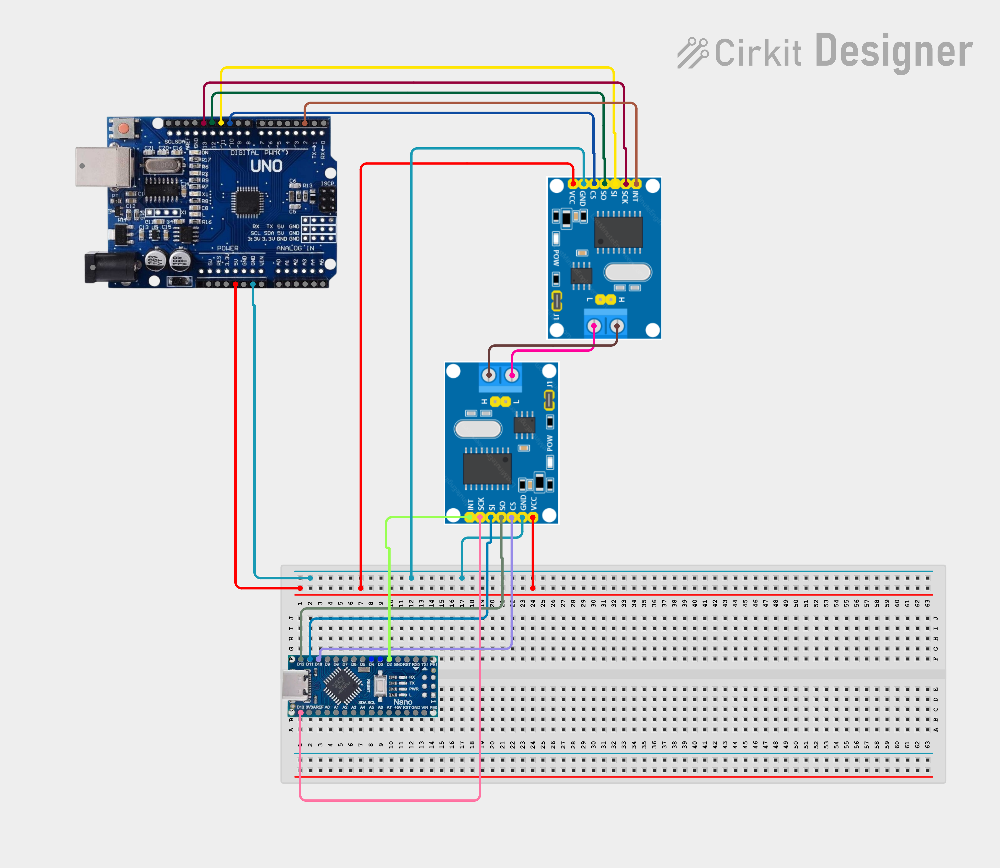
*Wiring diagram created with [Cirkit Designer](https://www.cirkitdesigner.com/)*

This project is a physical simulation of a **CAN (Controller Area Network) bus**, the industry-standard protocol used in the automotive sector for communication between Electronic Control Units.

The system simulates concurrent data transmission - engine RPM and engine temperature - over a shared bus, demonstrating the core principles of **multiplexing**, **arbitration**, and **fault tolerance**.

## Hardware Used

* 1x Arduino Uno (Transmitter)
* 1x Arduino Nano (Receiver)
* 2x MCP2515 CAN controller modules (with TJA1050 transceiver)
* Jumper wires (male-to-female and male-to-male)
* 120Ω termination resistors (enabled via the J1 jumpers on each module)
* 1x Potentiometer (Stage 2 - simulates RPM input)
* 1x LDR + ~10kΩ resistor for a voltage divider (Stage 2 - simulates temperature input)
* 1x Push button (Stage 2 - simulates a brake/emergency alert)

## Wiring

Both Arduinos connect to their respective MCP2515 module over SPI:

| MCP2515 | Arduino Uno / Nano | Description |
|---------|--------------------|-----------|
| VCC     | 5V                 | Power supply (must be a stable 5V) |
| GND     | GND                | Common ground |
| CS      | D10                | Chip Select |
| SO      | D12                | MISO |
| SI      | D11                | MOSI |
| SCK     | D13                | Serial Clock |

**CAN bus (between the two modules):**

* `CANH` connected to `CANH`
* `CANL` connected to `CANL`
* Grounds of both Arduinos tied together for a common reference
* **Important:** the **J1** jumper needs to be placed on both modules to enable the 120Ω termination resistor at each end of the bus.

**Sensors (Stage 2, all on the transmitter/Uno side):**

| Component | Pin | Notes |
|---|---|---|
| Potentiometer wiper | A0 | Outer legs to 5V and GND |
| LDR | A1 | Voltage divider with a ~10kΩ resistor to GND |

| Push button | D3 | Other leg to GND; uses `INPUT_PULLUP`, no external resistor needed |

## Concepts Demonstrated

### 1. Multiplexing and Arbitration

The transmitter sends two competing messages onto the bus. CAN resolves collisions based on identifier priority - lower IDs win arbitration:

* `ID 0x050` (high priority): simulates engine temperature (1 byte)
* `ID 0x100` (low priority): simulates engine RPM (2 bytes)

The receiver listens to the bus and decodes each message according to its ID.

### 2. Fault Tolerance

To test the resilience of the hardware architecture, the 120Ω termination resistor was removed from one MCP2515 module while the system was running. See [Test 3](#test-3--fault-tolerance-termination-resistor-removed) below for what was actually observed.

## How to Run

1. Install the [mcp_can](https://github.com/coryjfowler/MCP_CAN_lib) library by *coryjfowler* in the Arduino IDE.
2. Upload `firmware/transmitter_uno/transmitter_uno.ino` to the Arduino Uno.
3. Upload `firmware/receiver_nano/receiver_nano.ino` to the Arduino Nano.
4. Open the Serial Monitor for both COM ports, set to **115200 baud**.

## Results & Testing

## Stage 1 - Simulated Values

### Test 1 - Normal operation

With both termination resistors in place, the transmitter sends a temperature frame (`0x050`) and an RPM frame (`0x100`) every 500ms, and the receiver decodes both correctly. The value sent by the transmitter matches exactly what the receiver decodes - confirmed below with the highlighted line showing `Temp: 108 C` and `RPM: 4200/4400` on both sides at the same timestamp:

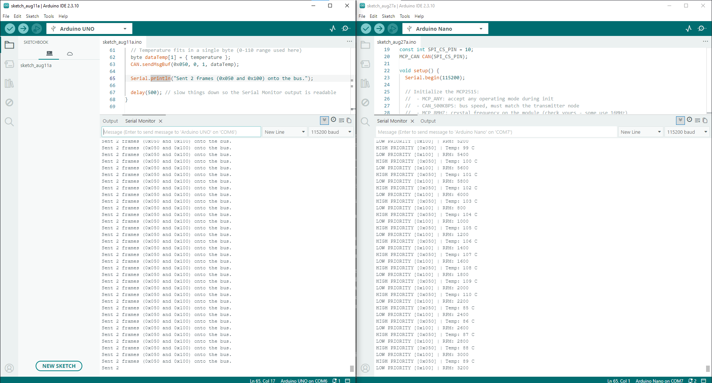

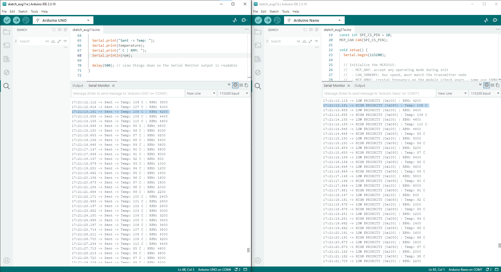

* Bus speed: 500 kbps
* Frame interval (transmitter): 500 ms
* Frames observed lost: none over multiple minutes of runtime

Note: frames are occasionally decoded slightly out of the transmitter's send order (e.g. RPM appearing to "arrive" close to Temp rather than strictly after it) - this is expected, since `0x050` has bus priority over `0x100` and can win arbitration even when generated after in the same loop iteration.

### Physical Build

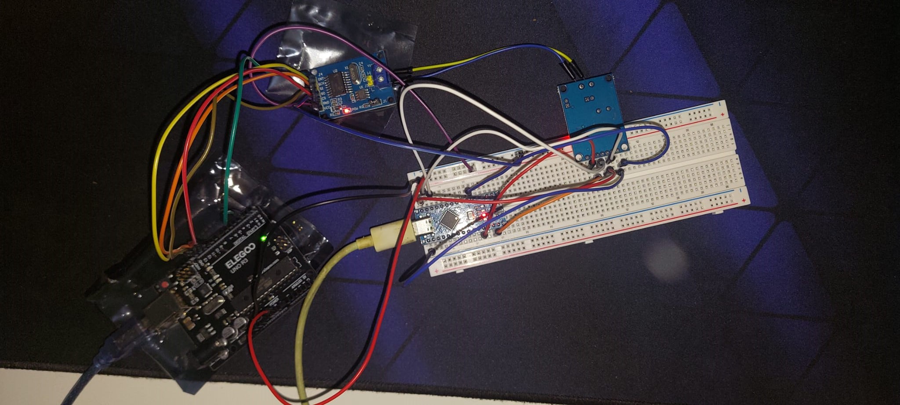

### Test 2 - Arbitration under load

* What was changed: reduced the transmitter's loop delay from 500ms to 20ms to increase bus traffic frequency and stress-test arbitration.
* What was observed: frames are received roughly every 30-40ms instead of ~500ms. Even when both frames are queued almost simultaneously (identical millisecond timestamp), the MCP2515 still resolves bus access according to CAN ID priority - `0x050` (temperature) consistently wins arbitration over `0x100` (RPM) whenever both are ready to transmit at the same time.

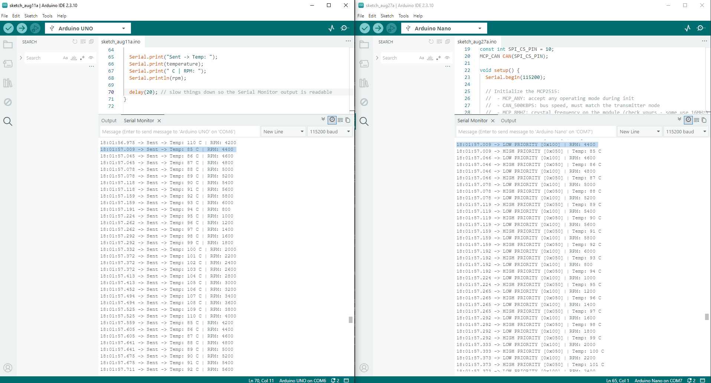

### Test 3 - Fault tolerance (termination resistor removed)

* **Action taken:** removed the J1 termination jumper on the receiver's MCP2515 module while the system was running normally.
* **Observed behavior:** the transmitter (Uno) kept sending frames uninterrupted. The receiver (Nano) stopped printing any output entirely - no corrupted data, no error messages, simply silence. This is consistent with the MCP2515 failing to decode valid frames over a degraded differential signal.

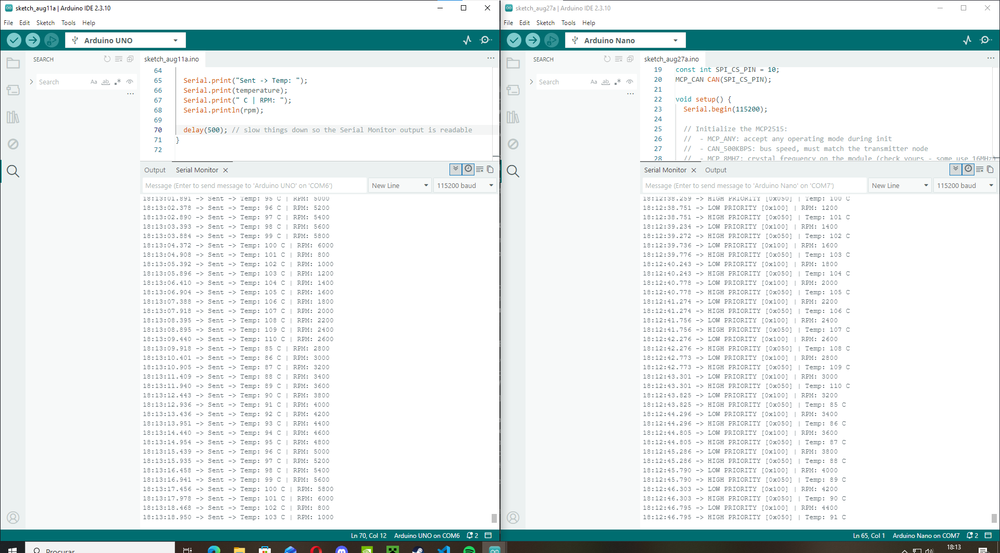

* **Recovery attempt 1 (restoring the jumper only):** simply placing the J1 jumper back did **not** resume communication. The receiver remained silent.
* **Recovery attempt 2 (re-uploading the receiver sketch):** re-uploading `receiver_nano.ino` - which re-runs `setup()` and calls `CAN.begin()` again - immediately restored communication.

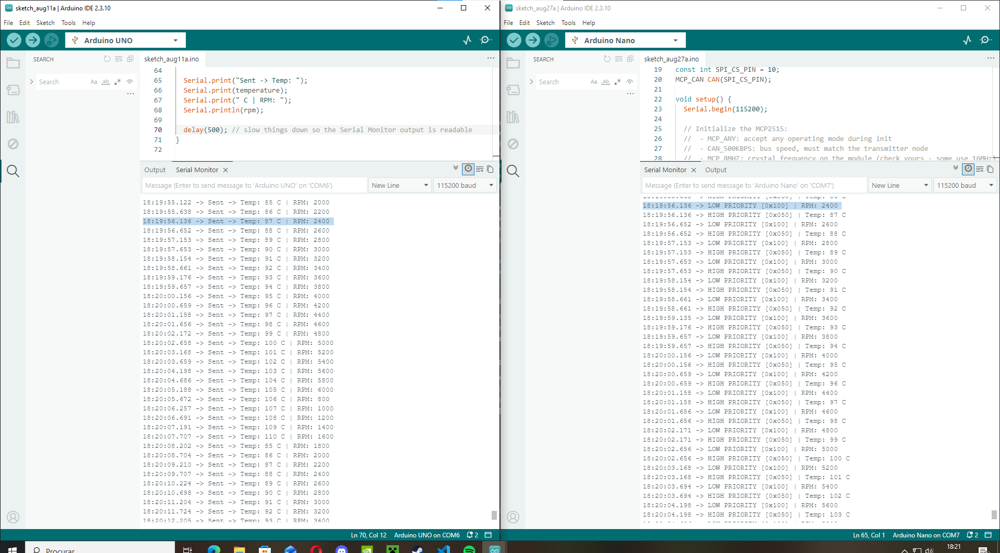

**Takeaway:** this matches real-world CAN behavior. Once a node's internal error counters cross the *Bus-Off* threshold (ISO 11898), the controller stops participating in the bus as a protection mechanism, and restoring the physical fault alone is not enough - the controller itself needs to be reinitialized. A production ECU would normally implement this recovery automatically in firmware (e.g. by periodically calling `CAN.begin()` again after detecting no valid traffic for too long). An automatic-recovery version of the receiver firmware was prototyped during this project and is a natural next step - see Roadmap below.

## Stage 2 - Real Sensor Input

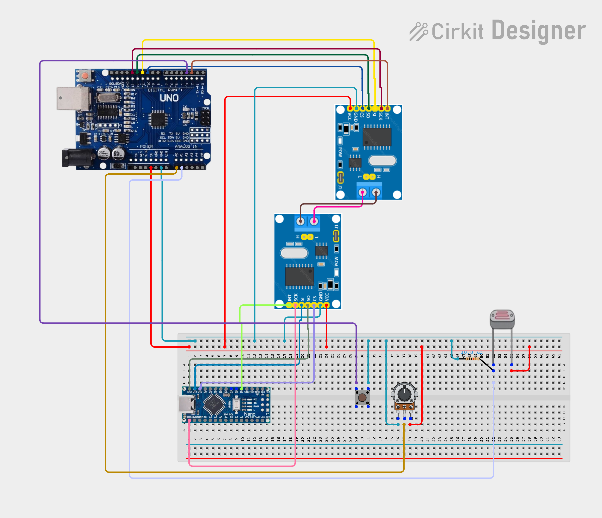
*Wiring diagram created with [Cirkit Designer](https://www.cirkitdesigner.com/)*

Stage 2 replaces the simulated values with three real sensors on the transmitter, and adds an event-driven, highest-priority alert signal alongside the two periodic ones:

* `ID 0x010` (highest priority, event-driven): brake/emergency alert, from a push button
* `ID 0x050` (medium priority, periodic): engine temperature, from an LDR
* `ID 0x100` (lowest priority, periodic): engine RPM, from a potentiometer

### Test 1 - Potentiometer → RPM

Rotating the potentiometer changes the decoded RPM value on the receiver in real time, matching the value sent by the transmitter.

### Test 2 - LDR → Temperature

Covering and uncovering the LDR produces a smooth, real-time change in the decoded temperature value - shown below rising from 99°C to 108°C as more light reaches the sensor.

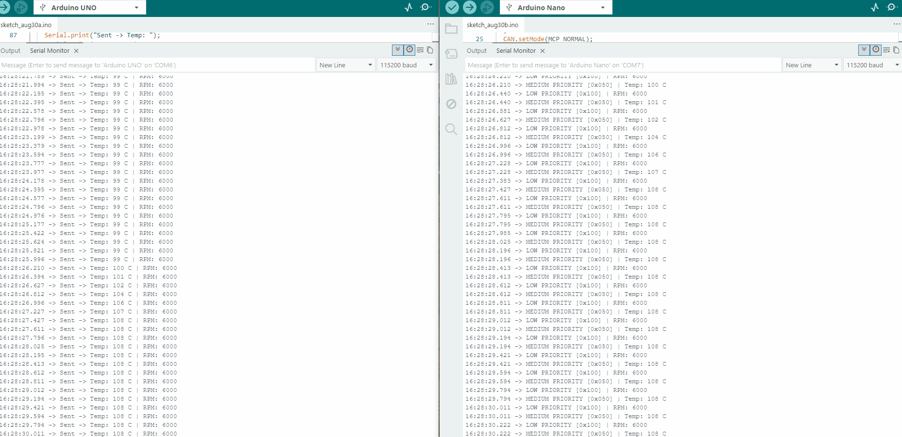

### Test 3 - Button → Brake alert (event-driven, highest priority)

Pressing the button immediately produces `BRAKE ALERT [0x010]` frames, interleaved with the ongoing periodic RPM/Temp traffic rather than replacing it - confirming the alert is sent as an independent, additional signal on the bus.

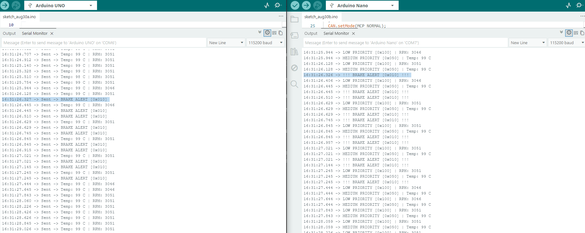

### Test 4 - Arbitration with three priority levels

With RPM and Temp frames already flowing, pressing the button shows the brake alert (`0x010`) being processed alongside the other two IDs without any noticeable delay, confirming three-level priority arbitration works as expected under real sensor-driven traffic (not just simulated values as in Stage 1's).

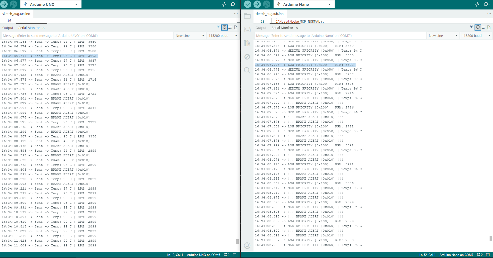

### Physical Build - Stage 2

## Roadmap

- [x] Stage 1: Minimal two-node CAN network
- [x] Stage 2: Sensor simulation (potentiometer, LDR, button)
- [ ] Stage 3: Physical actuator — stepper motor gauge driven by CAN RPM
- [ ] Stage 4: Real-time telemetry dashboard (Python/web)
- [ ] Stage 5: Hardware-level ID filtering on the MCP2515 (masks/filters)
- [ ] Stage 6: Automatic Bus-Off recovery in receiver firmware (software watchdog)

## Project History

- [Stage 1 (v1.0)](https://github.com/GSobral99/can-bus-arduino-simulator/releases/tag/v1.0-stage1) - initial minimal two-node network, arbitration and fault-tolerance testing
- [Stage 1 (v1.1)](https://github.com/GSobral99/can-bus-arduino-simulator/releases/tag/v1.1-stage1)
- [Stage 1 (v1.2)](https://github.com/GSobral99/can-bus-arduino-simulator/releases/tag/v1.2-stage1) - added physical build photo
- [Stage 2 (v2.0)](https://github.com/GSobral99/can-bus-arduino-simulator/releases/tag/v2.0-stage2) - real sensor input (potentiometer, LDR, button) with a third, event-driven CAN ID

## License

This project is licensed under the MIT License - see the [LICENSE](LICENSE) file for details.